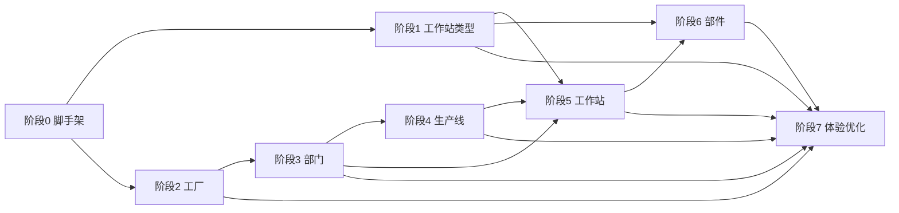

# Task: 公司架构模块迁移任务拆解

> 对应 Spec: [spec.md](./spec.md)  
> **状态**: 待开始  
> **最后更新**: 2026-07-05

---

## 任务总览

| 阶段 | 名称 | 任务数 | 依赖 | 状态 |
|------|------|--------|------|------|
| 0 | 项目脚手架 | 15 | — | ⬜ 待开始 |
| 1 | 工作站类型 | 8 | 阶段 0 | ⬜ 待开始 |
| 2 | 工厂信息 | 8 | 阶段 0 | ⬜ 待开始 |
| 3 | 生产部门 | 9 | 阶段 2 | ⬜ 待开始 |
| 4 | 生产线 | 10 | 阶段 3 | ⬜ 待开始 |
| 5 | 工作站 | 11 | 阶段 1, 3, 4 | ⬜ 待开始 |
| 6 | 部件信息 | 9 | 阶段 1, 5 | ⬜ 待开始 |
| 7 | 整合与体验优化 | 4 | 阶段 1–6 | ⬜ 待开始 |

**推荐执行顺序**: 0 → 1 → 2 → 3 → 4 → 5 → 6 → 7

> **架构说明**: 前后端为两个独立项目（`mes-api`、`mes-web`），不使用 monorepo。各自独立安装依赖、构建与部署。

---

## 阶段 0: 项目脚手架

> **目标**: 初始化两个独立项目，分别可运行并联调  
> **验收**: 两个终端分别启动前后端，`GET /api/v1/health` 返回 200，前端展示侧边栏

### 0.1 后端项目 `mes-api`

- [ ] **T0-01** 创建 `mes-api` 独立项目目录
  - `package.json`（name: `mes-api`，独立依赖）
  - `tsconfig.json`
  - `.gitignore`（node_modules, dist, .env）
- [ ] **T0-02** 初始化 Express + TypeScript 项目结构
  - `src/index.ts` — 入口，挂载路由、中间件
  - `src/middleware/errorHandler.ts` — 全局错误处理
  - `.env.example` — `PORT`, `DATABASE_URL`, `CORS_ORIGIN`
- [ ] **T0-03** 配置 CORS 中间件（允许 `mes-web` 开发地址跨域）
- [ ] **T0-04** 配置 Drizzle ORM
  - `drizzle.config.ts`
  - `src/db/index.ts` — pg 连接池
  - 运行 `drizzle-kit introspect` 生成 schema（暂不全量提交）
- [ ] **T0-05** 实现 `GET /api/v1/health` 路由
- [ ] **T0-06** 编写 `mes-api/README.md`（安装、启动、环境变量说明）

### 0.2 前端项目 `mes-web`

- [ ] **T0-07** 创建 `mes-web` 独立项目目录
  - `package.json`（name: `mes-web`，独立依赖）
  - `tsconfig.json`
  - `.gitignore`（node_modules, dist, .env）
- [ ] **T0-08** 初始化 Vite 8 + React 18 + TypeScript 8 项目
- [ ] **T0-09** 安装配置 Ant Design 5（ConfigProvider 中文）
- [ ] **T0-10** 配置 TanStack Router
  - `routes/__root.tsx` — 根布局
  - `routes/index.tsx` — 首页重定向
  - 公司架构 6 个子路由（占位页面）
- [ ] **T0-11** 实现 `src/api/client.ts` fetch 封装（支持 `VITE_API_BASE_URL`）
- [ ] **T0-12** 实现 `AppLayout` 组件
  - 侧边栏菜单（公司架构 + 6 子项）
  - 顶栏 + 内容区
  - 菜单项与 TanStack Router 联动
- [ ] **T0-13** 编写 `mes-web/README.md`（安装、启动、环境变量说明）

### 0.3 联调

- [ ] **T0-14** 配置 Vite proxy `/api` → `localhost:3001`
- [ ] **T0-15** 双终端联调验证：前端通过 proxy 访问 health 接口

---

## 阶段 1: 工作站类型

> **目标**: 第一个完整 CRUD 模块，作为后续模块模板  
> **表**: `basic_workstationtype`  
> **路由**: `/company-structure/workstation-types`  
> **依赖**: 阶段 0  
> **验收**: 工作站类型增删改查全流程可用

### 1.1 后端（mes-api）

- [ ] **T1-01** Drizzle schema: `src/db/schema/workstation-type.ts`
- [ ] **T1-02** zod 校验: `src/schemas/workstation-type.ts`
- [ ] **T1-03** Service: `src/services/workstation-type.service.ts`
  - list / getById / create / update / setActive / softDelete
  - create 使用 `nextval('basic_workstationtype_id_seq')`
  - number 唯一性校验
- [ ] **T1-04** Routes: `src/routes/workstation-types.ts`
  - 挂载到 `/api/v1/workstation-types`

### 1.2 前端（mes-web）

- [ ] **T1-05** 类型定义: `src/types/workstation-type.ts`
- [ ] **T1-06** API: `src/api/workstation-types.ts`
- [ ] **T1-07** 列表页: `src/routes/company-structure/workstation-types/index.tsx`
  - ahooks `useAntdTable`
  - 搜索、分页、新建/编辑/启用/停用/删除
- [ ] **T1-08** 编辑表单组件: `src/components/company-structure/WorkstationTypeForm.tsx`
  - 字段: number, name, description, subassembly, active

---

## 阶段 2: 工厂信息

> **目标**: 工厂 CRUD  
> **表**: `basic_factory`  
> **路由**: `/company-structure/factories`  
> **依赖**: 阶段 0  
> **验收**: 工厂增删改查全流程可用

### 2.1 后端（mes-api）

- [ ] **T2-01** Drizzle schema: `src/db/schema/factory.ts`
- [ ] **T2-02** zod 校验: `src/schemas/factory.ts`
- [ ] **T2-03** Service: `src/services/factory.service.ts`
- [ ] **T2-04** Routes: `src/routes/factories.ts`

### 2.2 前端（mes-web）

- [ ] **T2-05** 类型 + API: `src/types/factory.ts`, `src/api/factories.ts`
- [ ] **T2-06** 列表页: `src/routes/company-structure/factories/index.tsx`
- [ ] **T2-07** 编辑表单: `src/components/company-structure/FactoryForm.tsx`
  - 字段: number, name, city, active
- [ ] **T2-08** 提取通用 `EntityListPage` / `useEntityCrud` hook（复用阶段 1 逻辑）

---

## 阶段 3: 生产部门

> **目标**: 部门 CRUD + 工厂关联  
> **表**: `basic_division`  
> **路由**: `/company-structure/divisions`  
> **依赖**: 阶段 2（工厂下拉数据源）  
> **验收**: 部门可关联工厂，列表显示工厂名称，支持按工厂筛选

### 3.1 后端（mes-api）

- [ ] **T3-01** Drizzle schema: `src/db/schema/division.ts`
- [ ] **T3-02** zod 校验: `src/schemas/division.ts`
- [ ] **T3-03** Service: `src/services/division.service.ts`
  - list 支持 `factoryId` 筛选
  - list JOIN `basic_factory` 返回 `factoryName`
- [ ] **T3-04** Routes: `src/routes/divisions.ts`

### 3.2 前端（mes-web）

- [ ] **T3-05** 类型 + API: `src/types/division.ts`, `src/api/divisions.ts`
- [ ] **T3-06** 列表页: `src/routes/company-structure/divisions/index.tsx`
  - 列: 编号, 名称, 工厂, 状态
  - 筛选: 工厂下拉
- [ ] **T3-07** 编辑表单: `src/components/company-structure/DivisionForm.tsx`
  - 工厂 Select（`GET /factories?active=true&size=1000`）
- [ ] **T3-08** 通用 `LookupSelect` 组件（封装远程下拉请求）

### 3.3 测试

- [ ] **T3-09** 验证: 创建部门关联工厂后，列表正确显示工厂名称

---

## 阶段 4: 生产线

> **目标**: 生产线 CRUD + 部门多对多关联  
> **表**: `productionlines_productionline`, `jointable_division_productionline`  
> **路由**: `/company-structure/production-lines`  
> **依赖**: 阶段 3  
> **验收**: 生产线可关联多个部门，junction 表正确读写

### 4.1 后端（mes-api）

- [ ] **T4-01** Drizzle schema: `production-line.ts` + `division-production-line.ts`（junction）
- [ ] **T4-02** zod 校验: `src/schemas/production-line.ts`（含 `divisionIds: number[]`）
- [ ] **T4-03** Service: `src/services/production-line.service.ts`
  - create/update 时事务处理 junction 表（先删后插）
  - getById 返回 `divisionIds`
  - list 支持 `divisionId` 筛选
- [ ] **T4-04** Routes: `src/routes/production-lines.ts`

### 4.2 前端（mes-web）

- [ ] **T4-05** 类型 + API: `src/types/production-line.ts`, `src/api/production-lines.ts`
- [ ] **T4-06** 列表页: `src/routes/company-structure/production-lines/index.tsx`
  - 列: 编号, 名称, 位置, 关联部门（Tag 展示）, 是否生产型, 状态
- [ ] **T4-07** 编辑表单: `src/components/company-structure/ProductionLineForm.tsx`
  - 部门多选 `Select mode="multiple"`
  - place 硬编码枚举
- [ ] **T4-08** 筛选: 按部门过滤

### 4.3 测试

- [ ] **T4-09** 验证: 创建生产线关联 2 个部门，编辑改为 1 个，junction 表正确
- [ ] **T4-10** 验证: 按部门筛选列表

---

## 阶段 5: 工作站

> **目标**: 工作站 CRUD + 多级关联 + 状态切换  
> **表**: `basic_workstation`  
> **路由**: `/company-structure/workstations`  
> **依赖**: 阶段 1, 3, 4  
> **验收**: 工作站可关联类型/部门/生产线，状态可切换

### 5.1 后端（mes-api）

- [ ] **T5-01** Drizzle schema: `src/db/schema/workstation.ts`
- [ ] **T5-02** zod 校验: `src/schemas/workstation.ts`
- [ ] **T5-03** Service: `src/services/workstation.service.ts`
  - list 支持 `divisionId`, `productionLineId`, `workstationTypeId` 筛选
  - list JOIN 返回 typeName, divisionName, productionLineName
  - `setState(id, state)` 方法
- [ ] **T5-04** Routes: `src/routes/workstations.ts`
  - 含 `PATCH /:id/state`

### 5.2 前端（mes-web）

- [ ] **T5-05** 类型 + API: `src/types/workstation.ts`, `src/api/workstations.ts`
- [ ] **T5-06** 列表页: `src/routes/company-structure/workstations/index.tsx`
  - 列: 编号, 名称, 类型, 部门, 生产线, 状态(运行/停止), 启用状态
  - 操作: 启动/停止按钮
- [ ] **T5-07** 编辑表单: `src/components/company-structure/WorkstationForm.tsx`
  - 类型 Select
  - 部门 Select → onChange 过滤生产线下拉
  - 生产线 Select
- [ ] **T5-08** 多条件筛选栏（类型、部门、生产线）

### 5.3 测试

- [ ] **T5-09** 验证: 选部门后生产线下拉只显示该部门关联的线
- [ ] **T5-10** 验证: 状态切换 01stopped ↔ 02launched
- [ ] **T5-11** 验证: 多条件组合筛选

---

## 阶段 6: 部件信息

> **目标**: 部件 CRUD + 类型/工作站关联  
> **表**: `basic_subassembly`  
> **路由**: `/company-structure/subassemblies`  
> **依赖**: 阶段 1, 5  
> **验收**: 部件可关联类型和工作站，支持按工作站筛选

### 6.1 后端（mes-api）

- [ ] **T6-01** Drizzle schema: `src/db/schema/subassembly.ts`
- [ ] **T6-02** zod 校验: `src/schemas/subassembly.ts`
- [ ] **T6-03** Service: `src/services/subassembly.service.ts`
  - list 支持 `workstationId`, `workstationTypeId` 筛选
  - JOIN 返回 typeName, workstationName
- [ ] **T6-04** Routes: `src/routes/subassemblies.ts`

### 6.2 前端（mes-web）

- [ ] **T6-05** 类型 + API: `src/types/subassembly.ts`, `src/api/subassemblies.ts`
- [ ] **T6-06** 列表页: `src/routes/company-structure/subassemblies/index.tsx`
- [ ] **T6-07** 编辑表单: `src/components/company-structure/SubassemblyForm.tsx`
  - 类型 Select → onChange 过滤工作站下拉
  - 工作站 Select
  - type 硬编码枚举
- [ ] **T6-08** 筛选: 按工作站、类型

### 6.3 测试

- [ ] **T6-09** 验证: 选类型后工作站下拉正确过滤

---

## 阶段 7: 整合与体验优化

> **目标**: 打磨交互体验与整体一致性  
> **依赖**: 阶段 1–6 全部完成

- [ ] **T7-01** 公司架构总览页（可选）
  - 路由: `/company-structure`
  - Ant Design `Tree` 或 `Card` 层级展示: 工厂 → 部门 → 生产线 → 工作站 → 部件
- [ ] **T7-02** 全局搜索（ahooks `useDebounce`）
  - 顶栏搜索框，跨模块按 number/name 搜索，跳转对应列表
- [ ] **T7-03** 统一错误提示（Ant Design `message` / `notification`）
- [ ] **T7-04** 统一 loading 状态（表格、表单提交）

---

## 任务依赖图

---

## 通用组件清单（跨阶段复用）

| 组件 / Hook | 项目 | 首次创建 | 用途 |
|-------------|------|----------|------|
| `api/client.ts` | mes-web | T0-11 | fetch 封装 |
| `AppLayout` | mes-web | T0-12 | 侧边栏布局 |
| `EntityListPage` | mes-web | T2-08 | 通用列表页骨架 |
| `useEntityCrud` | mes-web | T2-08 | 通用 CRUD hook |
| `LookupSelect` | mes-web | T3-08 | 远程下拉选择 |
| `ActiveStatusTag` | mes-web | T1-07 | 启用/停用标签 |
| `ConfirmDeleteButton` | mes-web | T1-07 | 删除确认 |
| CORS middleware | mes-api | T0-03 | 跨域支持 |
| errorHandler | mes-api | T0-02 | 统一错误响应 |

---

## 进度追踪

> 完成后将 ⬜ 改为 ✅，进行中改为 🔄

| 任务 ID | 状态 | 完成日期 | 备注 |
|---------|------|----------|------|
| T0-01 ~ T0-15 | ⬜ | | 前后端独立初始化 |
| T1-01 ~ T1-08 | ⬜ | | |
| T2-01 ~ T2-08 | ⬜ | | |
| T3-01 ~ T3-09 | ⬜ | | |
| T4-01 ~ T4-10 | ⬜ | | |
| T5-01 ~ T5-11 | ⬜ | | |
| T6-01 ~ T6-09 | ⬜ | | |
| T7-01 ~ T7-04 | ⬜ | | 体验优化 |

**总计**: 74 项任务
